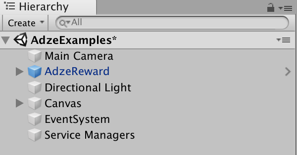
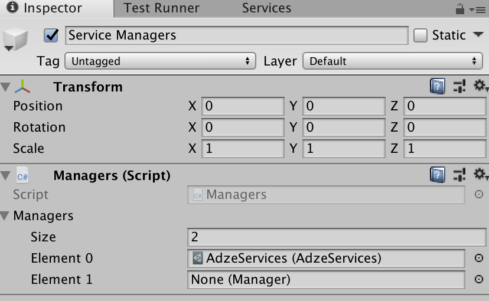
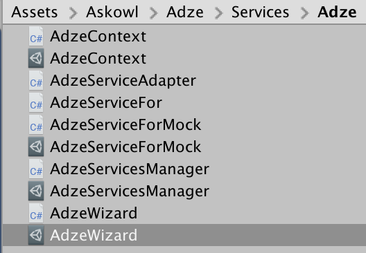
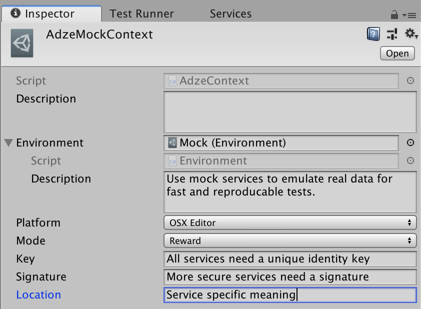
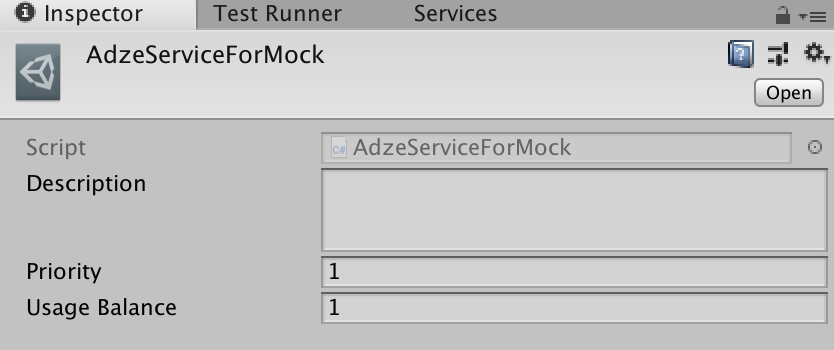
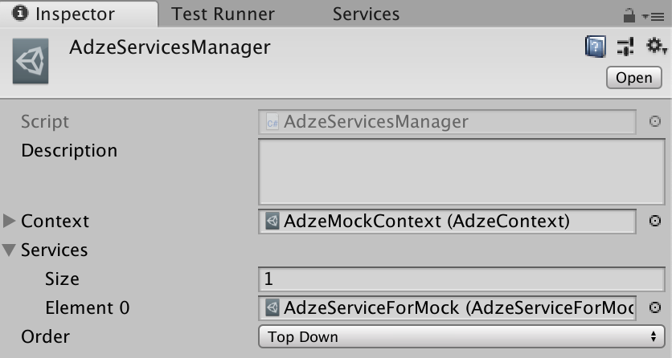
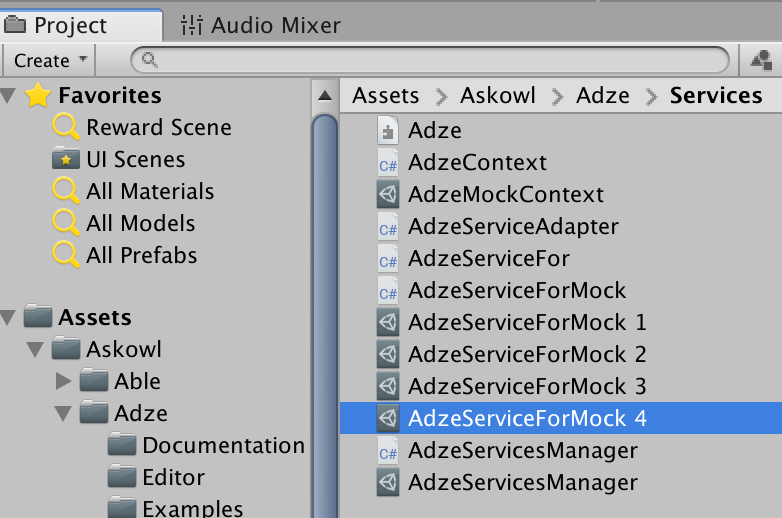
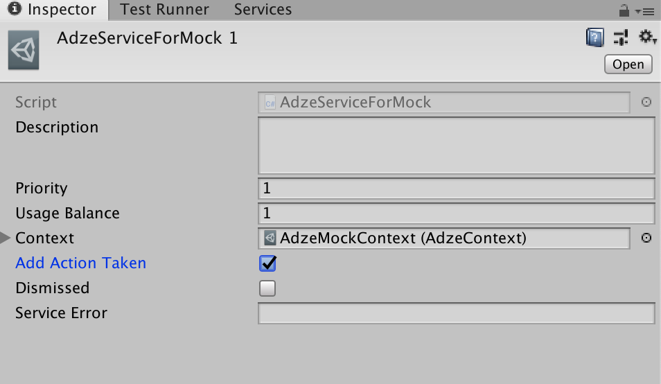

* Table of Contents
{:toc}

> The Doxygen pages are [here](https://paulmarrington.github.io/Unity-Documentation/Decoupler/Doxygen/html/annotated.html)

# [Executive Summary](http://www.askowl.net/unity-decoupler)

The Askowl Decoupler is here to provide an interface between your code and Unity packages. Take analytics packages as an example. There are dozens of them. With Askowl Decoupler you can switch between them depending on which you have installed. You can also choose at platform build time. Not all analytics packages support XBox or Web apps. The same logic works for databases, social networks, authentication and many others.

> Read the code in the Examples Folder.

# Videos

# Cheat-Sheet
#### Menu Items
* Create a new Decoupled Interface: ***Assets / Create / Decoupled / New Service***

# Introduction

Decoupling software components and systems have been a focus for many decades. In the 80s we talked about software black boxes. You didn't care what was inside, just on the inputs and outputs.

Microsoft had much fun in the 90's designing and implementing COM and DCOM. I still think of this as the high point in design for supporting decoupled interfaces.

Now we have Web APIs, REST or SOAP interfaces and micro-services. Design patterns such as the Factory Pattern are here to "force" decoupling at the enterprise software level. There have been dozens of standards over the years.

Despite this, developers have continued to create tightly coupled systems.

Consider a simple example. I have an app that uses a Google Maps API to translate coordinates into a description "Five miles south-west of Gundagai". My app is running on an iPhone calling into a cloud of Google servers. The hardware is different and remote, and they both use completely different software systems. However, my app won't run, or at least perform correctly, without Google. Worse still if I am using a Google library, it won't even compile without a copy.

# What is the Askowl Decoupler
First and foremost, the Askowl Decoupler is a way to decouple your app from packages in the Unity3D ecosystem. This would include sub-systems withing your app or game.

It works at the C# class level, meaning that it does not provide the physical separation. That is done by the Unity packages when needed. In approach, it acts very much like a C# Interface.

# What does the Askowl Decoupler give me?
1. You can build and test your app while waiting for supporting Unity packages to be complete.
2. You can choose between unity packages without changing your app code. Changing from Google Analytics to Unity Analytics to Fabric is as simple as getting or writing the connector code.
3. You can provide a standard interface to a related area. For social media, the interface could support FaceBook, Twitter, Youtube and others. You could then send a command to one, some or all of them. Think of this regarding posting to multiple platforms.
4. You can have more than one service then cycle through them or select one at random. For advertising, you can move to a new platform if the current one cannot serve you an ad.
5. Mocking is merely another decoupled package, albeit the first one you will write.

# Decoupling Packages

## How do I use a decoupled package?
A service has one or more entry points. The following example is for one called `show`.
``` c#
manager = Manager.Load<AdzeServicesManager>("AdzeServicesManager.asset");
showService = Service<AdzeServiceAdapter.ShowDto>.Instance;
showService.Dto.request = (firstValue, secondValue);
emitter = manager.CallService(showService);
//... later once the emitter has fired
response = showService.Dto.response;
```
Because of the unusual design decisions, this code needs some explanation.

1. A service manager is responsible for getting an acceptable service and for switching to a fallback if a service fails. Static cache it if there is one primary service with or without fallback. Don't cache for random or round-robin implementations.
2. A service may have many entry points. Each entry point has it's own data transfer object (DTO). Here we get a DTO and fill in request data.
3. A service has a single method `CallService` with an override for very entry point DTO. It returns an emitter which is fired once the service is complete.
4. Once done, the service will fill in a response struct/tuple/struct that can be accessed through the DTO.

### To send to all viable services
Another type of service is to have multiple instances, and we need to do something with all of them. It could be anything from display a list of names for user selection or call a method on some or all of them. `Social` is one of these where we may be connected to multiple social networks and send a message to some.

```c#
showService = Service<AdzeServiceAdapter.ShowDto>.Instance;
do {
  emitter = manager.CallService(showService);
  showService = Service<AdzeServiceAdapter.ShowDto>.Next;
} while (showService != null);
```

### How do I know if there is a service implemented
All service interfaces have a method `IsExternalServiceAvailable()`.

```c#
  if (!Decoupled.Social.IsExternalServiceAvailable()) Debug.Log("Oops");
```

## How much work do I need to do to add a service to an existing framework?
There is a wizard under asset creation for adding a new service entry point. You will end up with a script with an abstract function to fill in for each service entry point.

## How do I create a new decoupled service framework
The Askowl Decoupler package includes a wizard that creates the framework for your new service. follow the [Adze sample below](#adze-a-sample-service) to see how to fill in your service specific pieces.

### Adze: A Sample Service
* Creating a new service is easy. Just select the Assets or Project context menu ***Create // Decoupled // New Service***
* You will be asked to give a name to your service. Make the name descriptive. Your service will be created in a directory of the same name. Rename or move it as you wish.
* Your scene is updated with a ***Service Managers*** game object with a Managers component adding your service manager.





* If the service directory isn't under a scripts directory you will need to add an assembly definition (Assets or Project context menu ***Create // Assembly Definition***)
* Here I have renamed the ***Adze*** directory to ***Scripts*** and created an assembly definition file
* There are four C# source files generated and three services.



* Let's look at the source files first. They are all named starting with the name you gave your service.
  * The `Context` file requires editing. It is used to compare every service against the current context. Every context asset has an environment. `Production`, `Staging`, `Test` and `Mock` are provided as custom asset Enumerations, but you can add more. Adze, as seen here, filters services on running platform and advertisement type. The context will also hold data to be sent to the underlying services.

```c#
  [CreateAssetMenu(menuName = "Custom Assets/Services/Adze/Context", fileName = "AdzeContext")]
  public class AdzeContext : Services<AdzeService, AdzeContext>.Context {

    #region Context Equality
    public enum Mode { Banner, Interstitial, Reward }
    [SerializeField] public RuntimePlatform platform = default;
    [SerializeField] public Mode mode = Mode.Reward;
    #endregion

    #region Connection Data
    [SerializeField] public string key = default;
    [SerializeField] public string signature = default;
    [SerializeField] public string location = default;
    #endregion

    protected bool Equals(AdzeContext other) =>
      base.Equals(other) && Equals(platform, other.platform) && Equals(mode, other.mode);
  }
```

  * The next file requiring attention is the `ServiceAdapter`. It provides some helpers.
    * `Prepare()` in case we have to boot the external service provider.
    * `GetAnEmitter()` that all the asynchronous services will return so that the calling code can wait on a result.
    * `Error(message)` when something unfortunate happens.
    * `Log(action, message)` to record interesting information for analytics.
    * `LogOnResponse()` is called when the emitter is fired.

   Many service adapters are just a list of interface methods to implement in concrete services. Sometimes, like here, an interface can be massaged for concrete service differences.

``` c#
  [CreateAssetMenu(menuName = "Custom Assets/Services/Adze/Service", fileName = "AdzeServiceAdapter")]
  public class AdzeServiceAdapter : Services<AdzeServiceAdapter, AdzeContext>.ServiceAdapter {
    [Serializable] public class Result {
      public bool AdActionTaken;
      public bool Dismissed;
      public string ServiceError;

      internal static Result Instance(Emitter emitter) =>
        Result<Result>(emitter);

      internal Result Clear() {
        AdActionTaken = Dismissed = default;
        ServiceError  = default;
        return this;
      }
    }

    protected override void Prepare() { }

    // Registered with Emitter to provide common logging
    protected override void LogOnResponse(Emitter emitter) {
      var result = Result.Instance(emitter);
      if (result.ServiceError != default) {
        if (!string.IsNullOrEmpty(result.ServiceError)) Error($"Service Error: {result.ServiceError}");
      } else if (result.Dismissed) {
        Log("Dismissed", "By Player");
      } else {
        Log("Action", result.AdActionTaken ? "Taken" : "Not Taken");
      }
    }

    public Emitter Show() {
      Log(action: "Show", message: "Now");
      var emitter = GetAnEmitter<Result>();
      var result  = Result.Instance(emitter).Clear();
      Display(emitter);
      return result.ServiceError == default ? emitter : null;
    }

    protected virtual string Display(Emitter emitter) =>
      throw new NotImplementedException();
  }
```

  * `AdzeServiceFor` is a bare framework class to be duplicated for each `real` service. Use the wizard at *Asset/Create/Decoupled/**XXX**/New Entry Point*.

``` c#
  [CreateAssetMenu(menuName = "Custom Assets/Services/Adze/ServiceFor", fileName = "AdzeServiceFor")]
  public abstract class AdzeServiceFor : AdzeServiceAdapter {
    protected override void Prepare() => base.Prepare();

    protected override void LogOnResponse(Emitter emitter) =>
      base.LogOnResponse(emitter);

    protected override string Display(Emitter emitter) =>
      throw new NotImplementedException();
  }
```

  * The first concrete service implementation is `ServiceForMock`. Create the simplest possible version that will work at this stage. We would want to check on what happens on conditions such as a service error. We will leave hefty mocking to the next section.

``` c#
  [CreateAssetMenu(menuName = "Custom Assets/Services/Template/Service", fileName = "TemplateSelector")]
  public class AdzeServiceAdapterForMock : AdzeServiceAdapter {
    protected override string Display(Emitter emitter, Result result) {
      Log("Mocking", "Display Advertisement");
      result.ServiceError = default;
      result.Dismissed = false;
      result.AdActionTaken = true;
      emitter.Fire();
    }
  }
```

  * The final file created is `ServicesManager` does not require editing. It selects services from the list that match a global context. More on that later.

* The helper also creates three asset files.
  * `MockContext` is the context you will want to use when you don't want to annoy a real service. It is used for development, particularly of edge cases, and to reproduce problems (bugs) when they arise. It is also used to test other components that need the service in a reliable and usable way.  By default it will only work in the mock environment, under the Unity editor and in reward mode. There is more on mocking in the next section.



  * Using `ServiceForMock` is covered in detail below.



  * All concrete services, however, do have some information to review.
    * ***Priority*** provides simple ordering. Once the list of services has been filtered, it is sorted by priority. This only affects top-down and round-robin service selection. If a service fails, the next on the list is attempted.
    * ***Usage Balance*** defines how many repeat calls on a service are made before a new selection is used. It does not benefit top-down selection. In Adze, for example, we can use it to ensure that twice as many advertisements come from ChartBoost as from AdMob.
  * `ServiceManager` is where we reference all the services and provide a context to decide which to use. At this level the context is mostly about the target build - as in mock, development, test, staging or production. Thanks to service masking you can drop every service you create into the list, whether it is for a specific platform or type of service. ***Order*** is interesting. Services are filtered to match the context provided then presented as a list based on their priority (as set in each service asset). If they are all the same priority the element order here counts. Values for order are:
    * ***Top Down*** where the first service is always used. If it fails the next one is used, and so on until a service succeeds. Next call starts with the first again. Most services with more than one entry will work this way.
    * ***Round Robin*** starts with the first service. It is run once, then again ***Usage Balance*** number of times. Then the next viable service is called. When all have had a turn the first is called again. Useful for advertising where we want to spread our ads over multiple providers.
    * ***Random*** does as it says. Once ***Usage Balance*** is depleted it will select another entry at random.
    * ***Random Exhaustive*** does the same, except no service is selected more than once until all the other services have had a go.



### Service Masking

Mocking is all very well but real services will have libraries that talk to the outside world. And those libraries won't even load on all platforms. This is not a show-stopper because Able provides tools that make it easy to set C# compiler definitions that we can use to exclude code we can't use.

Look at `DetectService()` at the end of the template service adapter class. `InitializeOnLoadMethod` ensures that it is only run in the editor. It's only job is to see if a service package is available, and if it is create a c# compile-time symbol.

``` c#
[InitializeOnLoadMethod] private static void DetectService() {
  bool usable = DefineSymbols.HasFolder("Chartboost");
  DefineSymbols.AddOrRemoveDefines(addDefines: usable, named: "AdzeServiceForChartboost");
}
```

For focus and brevity reasons the service adapter excluded the masking code that comes as standard. Here is the full monty.

``` c#
using Askowl;
using UnityEditor;
using UnityEngine;
#if TemplateServiceFor
// Add using statements for service library here
#endif

[CreateAssetMenu(menuName = "Custom Assets/Services/Template/Service", fileName = "TemplateServiceFor")]
public abstract class TemplateServiceFor : TemplateServiceAdapter {
  #if TemplateServiceFor
  protected override void Prepare() => base.Prepare();

  protected override void LogOnResponse(Emitter emitter) => base.LogOnResponse(emitter);

  // Implement all interface methods that call concrete service adapters need to implement
  protected override void TemplateServiceMethod(Emitter emitter, TemplateServiceMethodResult result) {
    // Access the external service here. Save and call emitter.Fire when service call completes
    // or set result.ErrorMessage if the service call fails to initialise
  }
  #endif
}
```

Your Tasks are:

1. Edit `ServiceAdapter`
   1. The first task is to replace `TemplateServiceFor` with a unique service specific symbol. For Adze it could be `AdzeServiceForChartBoost`.
   2. Tell `DetectService()` whether to add or remove the compiler symbol. If the external service is using the Unity package manager, use `HasPackage`. Otherwise, hopefully, you can sense the presence base on the existence of a folder inside ***Assets***.
   3. Fill in the `Result` class with any common result data.
   4. Fill in what you can in support and general fields and methods. More will come to mind later when writing the concrete services.
   5. For each service method copy the three entities in `TemplateServiceMethod` and rename it to describe the service.
2. For each concrete service, duplicate the `ServiceFor` file and;
   2. Add a reference to the external service library in the fenced off area at the top of the file.
   3. Implement all the interface methods. Note that they are protected by a precompiler `#if` statement so they can make calls to to the external library safely.
   4. Use the information in `context`. Specifically don't access production issues unless `context.environment` is set to Production.

### Service Mocking
The service builder has generated a mock service for you. We filled it with very basic positive response above. It also generated one mocking service custom asset. This is often enough for most services. Not so for Adze. Advertising services are not critical and are more likely to fail. Duplicate this asset three time since they will all use the same code reference.



Let's move on to the source. Fortunately we encapsulated all the communications information in the `Result` and pass a reference to our concrete method. Further more, the data indicates behaviour driven testing. See the Adze documentation for the full Gherkin executable documentation. We will only do a subset here.

``` gherkin
@CustomAsset
Feature: Adze
  Adze provides a decoupled layer to external advertising services.

  Rule: First passing service will respond to a display request repeatedly

    Background:
      Given 4 services available
      And they are ordered  as "Round Robin"

    Example: The first service responds
      Given that all services work
      When I ask for an advertisement
      Then I get the first service
      When I ask for an advertisement again
      Then I get the second service

    #... Examples to cover all the other combinations
```

Before we can write the step definitions we are going to need to make necessary data available.

* Add `[SerializedField] public Result results` to the mock concrete service; plus
* Fill the result object passed to the service method with that set in the Inspector; and we get

``` c#
  [CreateAssetMenu(menuName = "Custom Assets/Services/Adze/ServiceForMock", fileName = "AdzeServiceForMock")]
  public class AdzeServiceForMock : AdzeServiceAdapter {
    [SerializeField] public Result mockResult;
    [SerializeField] private float secondsDelay = 0.1f;

    protected override string Display(Emitter emitter, Result result) {
      Log("Mocking", "Display Advertisement");
      result.dismissed     = mockResult.dismissed;
      result.adActionTaken = mockResult.adActionTaken;
      result.serviceError  = mockResult.serviceError;
      Fiber.Start.WaitFor(secondsDelay).Fire(emitter);
      return default;
    }
    public override bool IsExternalServiceAvailable() => true;
  }
```


Let's see if we have all we need for the step definitions.

* Providing there are more than we need we can truncate `ServiceManager.selector.Choices`.
* set `ServiceManager.selector.Choices[0].serviceError = default` to mark as passed OK.
* `ServiceManager.selector.CycleIndex` should be 0 after each run.

For more detail, go to ***Askowl BDD*** for information on writing and running Gherkin executable specifications and ***Askowl Adze*** for the full feature specifications and definitions for Adze.
