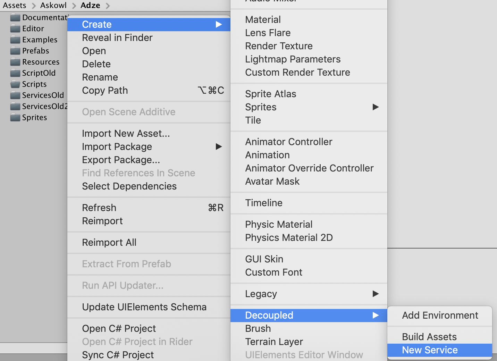
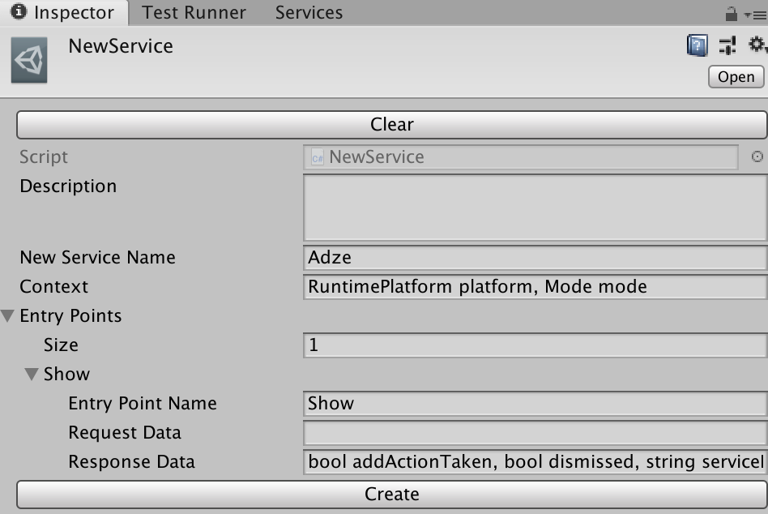

* Table of Contents
{:toc}

> The Doxygen pages are [here](https://paulmarrington.github.io/Unity-Documentation/Decoupler/Doxygen/html/annotated.html)

# [Executive Summary](http://www.askowl.net/unity-decoupler)

The Askowl Decoupler is here to provide an interface between your code and Unity packages. Take analytics packages as an example. There are dozens of them. With Askowl Decoupler you can switch between them depending on which you have installed. You can also choose the packages to use at platform build time. Not all analytics packages support XBox or Web apps. The same logic works for databases, social networks, authentication and more.

> Read the code in the Examples Folder.

# Videos

# Cheat-Sheet

##### Menu Items
> Where `Dddd` is the decoupled service name and `Cccc` is the name of a concrete service interface.
* Create a new Decoupled Interface: **Assets / Create / Decoupled / New Service**
* Add an Additional Context: **Assets/Create/Decoupled/`Dddd`/Add Context**
* Add a Concrete Service: **Assets/Create/Decoupled/`Dddd`/Add Concrete Service**
* Add New Environment: **Assets/Create/Decoupled/Add Environment**
* Build All Assets (any time): **Assts/Create/Decoupled/Build Assets**

##### Editing Required
* **`Dddd`/`Dddd`ServiceFor`Cccc`.cs**
  * Update `DetectService()` if the service does not have a folder or Unity package manager with the same name.
  * Use `Prepare()` to initialise the service as needed.
  * Implement call to real services in each entry point specific `Call()` method. Use the comments in each entry point as an indication of where and what to add.
* **`Dddd`/`Dddd`ServiceForMock.cs**
  * Implement a very simple mock in the `Call` method to fill in responses so that the service clients work.
  * Later sub-class this mock to add more complex mocking as needed.
* **`Dddd`/`Dddd`Context.cs** for context-specific support data. A URL may be different between Test and Production environments.

##### Entry Format for Context, Request and Response Fields
The New Service command asks for information to create context, request and response fields. Enter type/name pairs as a comma-separated list.

> int port, string mode, MyClass myClass
``` c#
Open(context.port);
Add = MyService.Add.Call((0x1245, Mode.Banner, new MyClass{a = 12}));
```

For request and response fields there must be at least two types/name pairs. For a single entry, provide the type only.

> MyResponse
``` c#
Scope.Dto.response = new MyResponse {result = "OK", Error = false};
```

##### How to Implement an Entry-Point
**`Dddd`/`Dddd`ServiceFor`Cccc`.cs** had a `Call` implementation override for every entry point DTO. Fire the `Emitter` reference when a response has been filled.

``` c#
public override Emitter Call(Add add) {
  MyService.Adder(onResponse: (response) => { add.response = response; add.Emitter.fire(); });
}
```

`Call` is made inside a Fiber.Closure so multiple calls may be outstanding at the same time.

##### How to Call a Service
Every entry point in a service adapter has an inner DTO class defined. Each entry point DTO has a static `Call` method that takes the request object and returns a reference to the DTO. Every DTO is of the form:

``` c#
public class EntryPoint<TRequest, TResponse> : Fiber.Closure {
  public TRequest  request;
  public TResponse response;
  public string    Error;
  public Emitter   Emitter = Emitter.Instance;
  public bool      Failed => Error != null;
  public static T Call<T>(TRequest request) where T : EntryPoint<TRequest, TResponse>;
}
```
A call will look like:

``` c#
fiber.WaitFor(_ => add = ServiceExampleServiceAdapter.Add.Call((firstValue, secondValue)).OnComplete).Do(_ => SomethingWith(add.response);
```

# Introduction

Decoupling software components and systems have been a focus for many decades. In the 80s we talked about software black boxes. You didn't care what was inside, just on the inputs and outputs.

Microsoft had much fun in the 90's designing and implementing COM and DCOM. I still think of this as the high point in design for supporting decoupled interfaces.

Now we have Web APIs, REST or SOAP interfaces and micro-services. Design patterns such as the Factory Pattern are here to "force" decoupling at the enterprise software level. There have been dozens of standards over the years.

Despite this, developers have continued to create tightly coupled systems.

Consider a simple example. I have an app that uses a Google Maps API to translate coordinates into a description "Five miles south-west of Gundagai". My app is running on an iPhone calling into a cloud of Google servers. The hardware is different and remote, and they both use completely different software systems. However, my app won't run, or at least perform correctly, without Google. Worse still if I am using a Google library, it won't even compile without a copy. If you want the same code to work on a Windows desktop and a mobile device you are very likely to need different supporting libraries. And perhaps you will want to use Apple Maps instead on iOS devices.

# What is the Askowl Decoupler
First and foremost, the Askowl Decoupler is a way to decouple your app from packages in the Unity3D ecosystem, including sub-systems you have created yourself.

It works at the C# class level, meaning that it does not provide the physical separation. That is done by the Unity packages when needed. In approach, it acts very much like a C# Interface.

# What does the Askowl Decoupler give me?
1. You can build and test your app while waiting for supporting Unity packages to be complete.
2. You can choose between unity packages without changing your app code. Changing from Google Analytics to Unity Analytics to Fabric is as simple as getting or writing the connector code.
3. You can provide a standard interface to a related area. For social media, the interface could support FaceBook, Twitter, Youtube and others. You could then send a command to one, some or all of them. Think of this regarding posting to multiple platforms.
4. You can have more than one service then cycle through them or select one at random. For advertising, you can move to a new platform if the current one cannot serve you an ad.
5. Decoupler includes a fallback mechanism, so if the primary interface fails or cannot serve the request, it tries other fallback services. These could be as simple as fallback servers on different URLs or as complex as a completely different service provider.
6. Mocking is merely another decoupled package, albeit the first one written.

# Decoupling Packages

## How do I use a decoupled package?
A service has one or more entry points. The following example is for one called `show`.

``` c#
AdzeServiceAdapter.Show show;
fiber.WaitFor(_ => (show = AdzeServiceAdapter.Show.Call()).OnComplete)
     .Do(_ => ProcessShowResponse(show.response);
```

### To send to all viable services
In the implementation for all the services, set `Error` to something. All services will be called in parallel.

### How do I know if there is a service implemented
All service interfaces have a method `IsExternalServiceAvailable()`.

```c#
  if (!Decoupled.Social.IsExternalServiceAvailable()) Debug.Log("Oops");
```

## How much work do I need to do to add a service to an existing framework?
There is a wizard in menu ***Assets/Create/Decoupled*** for adding a new concrete service. You end up with a script with `Call` functions to fill in for each entry point.

## How do I create a new decoupled service framework
The Askowl Decoupler package includes a wizard at menu ***Assets/Create/Decoupled/New Service*** that creates the framework for your new service. Follow the [Adze sample below](#adze-a-sample-service) to see how to fill in your service-specific pieces.


# Adze: A Sample Service
***Adze*** is a decoupled advertising manager. The source to the services is available on the Unity Store as ***Askowl Adze***.

## Building the Core Adze Service Manager

* Creating a new service is easy. Just select the Assets or Project context menu ***Create // Decoupled // New Service***

* You are asked to give a name to your service. Make the name descriptive. Your service appears in a directory of the same name. Rename or move it as you wish.

* Your scene is updated with a ***Service Managers*** game object with a Managers component adding your service manager.


Wait while Unity discovers and builds the generated scripts.


I added two context variables in the form - `RuntimePlatform` and `Mode`. The latter doesn't exist so that we get a compile error.


The offending code is in the context script.

``` c#
[CreateAssetMenu(menuName = "Decoupled/Adze/Add Context", fileName = "AdzeContext")]
public class AdzeContext : Services<AdzeServiceAdapter, AdzeContext>.Context {
  #region Service Validity Fields

  [SerializeField] public RuntimePlatform platform;

  [SerializeField] public Mode mode;

  protected bool Equals(AdzeContext other) =>
    base.Equals(other)  && Equals(platform, other.platform) && Equals(mode, other.mode);
  #endregion
}
```

To clean things up, I have created `Mode` and added a default.

``` c#
public enum Mode { Banner, Interstitial, Reward }
[SerializeField] public Mode mode = Mode.Reward;
```

* If the service directory isn't under a scripts directory you may need to add an assembly definition (Assets or Project context menu ***Create // Assembly Definition***)
* I have moved the files to ***Services*** and created an assembly definition file


* There is a decoupler wizard to build the necessary assets.


* After building assets, there are four C# source files generated and three services.

The asset builder wizard creates the necessary assets, but more are needed as you go along. Asset creation is in the same decoupler menu. Most likely you only the ***Add Context*** and ***Add Concrete Service*** options are of use.


* Let's look at the source files first. They are all named starting with the name you gave your service.
  * The `Context` file requires editing in addition to the changes done above.
    * It is used to compare every service against the current context. Every context asset has an environment. `Production`, `Staging`, `Test` and `Mock` are custom asset Enumerations, but you can add more.
    * Adze, as seen here, filters services on the running platform and advertisement type.
    * The context holds data to be sent to the underlying services. Every advertising service requires registration information. Some require a signature as well as a key. Some require a location string whose meaning is service specific.

``` c#
#region Other Context Fields
[SerializeField] public string key       = default;
[SerializeField] public string signature = default;
[SerializeField] public string location  = "Default";
#endregion
```

  * The next file requiring attention is the `ServiceAdapter`. It provides some helpers.
    * `Prepare()` in case we have to boot the external service provider.
    * `Error(message)` when something unfortunate happens.
    * `Log(action, message)` to record interesting information for analytics.
  * The wizard creates a DTO for each entry points and two methods to be overridden.
    * The DTO contains a request and a response object. If a single object specified by type only, it is named request or response respectively. Multiple items use a Tuple. Because Adze does not require a request object, it has an unused default `int` one.
    * The `Call` method is abstract, to be filled in on concrete implementations.
    * `Succeed` can be overridden for common functionality.

``` c#
public abstract class AdzeServiceAdapter : Services<AdzeServiceAdapter, AdzeContext>.ServiceAdapter {
  #region Service Support
  // Code that is common to all services belongs here
  protected override void Prepare() { }
  #endregion

  #region Public Interface
  // Methods calling code to call a service - over and above concrete interface methods below ones defined below.
  #endregion

  #region Service Entry Points
  // List of virtual interface methods that all concrete service adapters need to implement.

  /************* Show *************/
  public class ShowDto : DelayedCache<ShowDto> {
    public int /*-entryPointRequest-*/                                request;
    public (bool addActionTaken, bool dismissed, string serviceError) response;
  }
  public abstract Emitter Call(Service<ShowDto> service);
  #endregion
}
```

``` c#
    public virtual void Succeed(Service<ShowDto> service) {
      if (service.ErrorMessage != default) {
        if (!string.IsNullOrWhiteSpace(service.ErrorMessage)) Error(service.ErrorMessage);
      } else if (service.Dto.response.dismissed)
        Log("Dismissed", "By Player");
      else
        Log("Action", service.Dto.response.addActionTaken ? "Taken" : "Not Taken");

      service.Dto.response = service.Dto.response;
      service.Succeed();
    }
```

  * `AdzeServiceFor` is a bare framework class to be duplicated for each ***real*** or ***concrete*** service. Use the wizard at *Asset/Create/Decoupled/**XXX**/New Entry Point* to create a new service instance. This file won't need editing, but the concrete services generated from it will.
    * The first method is called `DetectService`. It sets a compiler "define" that allows concrete service-specific code only compiled if available. The line that requires change is the one that defines and sets the boolean `usable`. In almost all cases a service can be inferred by the existence of an asset, directory or entry in the Unity package manager. After updating this code, save and return to the editor. Unity updates the solution including the new compiler definition, and the relevant code is enabled.
    * `Prepare()` can be used to initialise the concrete service if needed. It is called once before the first call to a service entry point. Use it to initiate a connection and log in to the service.
    * `Call(service)` is the primary method for each entry point. Use it to call the concrete service, adjusting request and response data as needed. The service struct passed in contains all you need.
      * `ErrorMessage` is a string container. Give it content if the service fails to perform.
      * `Error` is a read-only boolean that returns true if there has been a failure.
      * `Emitter` is a lazy read-only reference to an emitter that can be used to indicate a response. Return it from the simplified `Call(service)` approach.
      * `Dto` is a reference to the data transfer object with `request` and `response` fields. Care has been taken to use a struct to reduce garbage collection load.
    * A simplified `Call(service)` is all that is needed if the concrete service provides a callback without complications. Delete the Fiber.Closure class and update the `Call` method directly.
    * If in doubt, use the Fiber.Closure framework provided. It adds very little overhead and gives the flexibility of precompiled fibers. Use a fiber closure if the service can have more than one outstanding request at any time. All changes occur in the `Activities` method of the closure which is called once per instance to precompile the fiber and any supporting methods. With caching only as many instances exist as are needed for concurrent operations.

``` c#
// Simplified approach
public override Emitter Call(Service<EntryPointDto> service) {
  // parse service.Dto.request into information this service entry point needs
  // call service. In callback fire service.Emitter
  return service.Emitter
}
```

  * The first concrete service implementation is `ServiceForMock`. Create the simplest possible version that works at this stage. We would want to check on what happens on conditions such as a service error. We leave hefty mocking to the next section. The call returns `null`. Without an emitter returned the service continues immediately. Use a fiber if you need to inject a delay.

``` c#
[CreateAssetMenu(menuName = "Decoupled/Adze/ServiceForMock", fileName = "AdzeServiceForMock")]
public class AdzeServiceForMock : AdzeServiceAdapter {
  public override Emitter Call(Service<ShowDto> service) {
    Debug.Log($"*** Mock Call '{GetType().Name}' '{typeof(ShowDto).Name}', '{service.Dto.request}");
    return null;
  }
  public override void OnResponse(Service<ShowDto> service) =>
    Debug.Log($"*** Mock Response '{GetType().Name}' '{typeof(ShowDto).Name}', '{service.Dto.response}");

  public override bool IsExternalServiceAvailable() => true;
}
```

  * The final file created is `ServicesManager` does not require editing. It selects services from the list that match a global context. More on that later.

* The wizard also creates three asset files.
  * `AdzeMockContext` is the context you want to use when you don't want to annoy a real service. It is for development, particularly of edge cases, and to reproduce problems (bugs) when they arise. It is also used to test other components that need service in a reliable and usable way.  By default, it only works in the mock environment, under the Unity editor and in reward mode. There is more on mocking in the next section.


  * Using `ServiceForMock` is covered in detail below.


  * All concrete services, however, do have some information to review.
    * ***Priority*** provides simple ordering. The list of services is filtered then sorted by priority. It only affects top-down and round-robin service selection. If a service fails, we go to the next on the list.
    * ***Usage Balance*** defines how many calls on service before moving on. It does not benefit top-down selection. In Adze, for example, we can use it to ensure that twice as many advertisements come from ChartBoost as from AdMob.
  * `ServiceManager` is where we reference all the services and provide a context to decide which to use. At this level, the context is mostly about the target build - as in mock, development, test, staging or production. Thanks to service masking you can drop every service you create into the list, whether it is for a specific platform or type of service. ***Order*** is interesting. Services are filtered to match the context provided then presented as a list based on their priority (as set in each service asset). If they are all the same priority the element order here counts. Values for order are:
    * ***Top Down*** where the first service has priority. If it fails, the next one is tried, and so on until a service succeeds. Next call starts with the first again. Most services with more than one entry work this way.
    * ***Round Robin*** starts with the first service. Once run once, then again ***Usage Balance*** repeats, the next viable service is called. When all have had a turn, then we start from the top. Useful for advertising where we want to spread our ads over multiple providers.
    * ***Random*** does as it says after depletion of ***Usage Balance***.
    * ***Random Exhaustive*** does the same, except no service is selected more than once until all the other services have had a go.


## Service Masking

Mocking is all very well, but real services have libraries that talk to the outside world. Moreover, those libraries won't even load on all platforms. It is not a show-stopper because Able provides tools that make it easy to set C# compiler definitions that we can use to exclude code we can't use.

Look at `DetectService()` at the start of the template service adapter class. `InitializeOnLoadMethod` ensures that it is only run in the editor. Its only job is to see if a service pack is available and if it creates a c# compile-time symbol.

``` c#
[InitializeOnLoadMethod] private static void DetectService() {
  bool usable = DefineSymbols.HasFolder("Chartboost");
  DefineSymbols.AddOrRemoveDefines(addDefines: usable, named: "AdzeServiceForChartboost");
}
```

We discuss the Chartboost service in detail below.

## Service Selection
* ***AdzeServiceManager*** is loaded as part of the first scene by being in the CustomAsset manager GameObject.
* ***AdzeServiceManager*** holds a reference to every concrete or mock service for this decoupled system. It also has a reference to a Context asset.
* Each concrete or mock service has a list of context assets it accepts. A mock service only works with a mock context. A concrete service may work with any combination of production, staging or test environments.
* When the game initialises, only services with matching contexts (using `Equals`) are selected. Moreover, only if the service itself says it is available using `IsExternalServiceAvailable()`. As it stands now
***AdzeServiceForMock*** will only match:
  * ***Mock*** environment
  * Editor platform (OSX or Windows)
  * Reward advertising mode
* So, service exclusion can happen because of context, no backing package or code specific reasons within the concrete driver.
* You will probably want to rename ***AdzeContext.asset*** to ***AdzeMockContext.asset*** and use it for mocking.

## Service Mocking
The service builder has generated a mock service for you. We filled it with a first positive response.  Advertising services are not critical and are more likely to fail. We need a fallback. Duplicate this asset three times since they use the same code reference.


Let's move on to the source. This type of investigation lends itself to behaviour driven testing. See the Adze documentation for the full Gherkin executable documentation.

``` gherkin
@CustomAsset
Feature: Adze
  Adze provides a decoupled layer to external advertising services.

  Rule: First passing service responds to a display request

    Background:
      Given 4 services available
      And they are ordered  as "Round Robin"

    Example: The first service responds
      Given that all services work
      When I ask for an advertisement
      Then I get the service 0
      When I ask for an advertisement
      Then I get the service 1

    #... Examples to cover all the other combinations
```

In production, we may choose "Top Down" where the preferred service gets priority. If we use "Round Robin" each service suitable for the running environment gets a turn.

Before we can write the step definitions, we are going to need to make the necessary data available.

* Add the response data as serialised fields to the mock concrete service

``` c#
[SerializeField] private bool   addActionTaken;
[SerializeField] private bool   dismissed;
[SerializeField] private string serviceError;
```

* Fill the result object passed to the service method with that set in the Inspector; and we get

``` c#
  [CreateAssetMenu(menuName = "Custom Assets/Services/Adze/ServiceForMock", fileName = "AdzeServiceForMock")]
  public class AdzeServiceForMock : AdzeServiceAdapter {
    [SerializeField] public Result mockResult;
    [SerializeField] private float secondsDelay = 0.1f;

    protected override string Display(Emitter emitter, Result result) {
      Log("Mocking", "Display Advertisement");
      result.dismissed     = mockResult.dismissed;
      result.adActionTaken = mockResult.adActionTaken;
      result.serviceError  = mockResult.serviceError;
      Fiber.Start.WaitFor(secondsDelay).Fire(emitter);
      return default;
    }
    public override bool IsExternalServiceAvailable() => true;
  }
```


Let's see if we have all we need for the step definitions.

* Providing there are more than we need we can truncate `ServiceManager.selector.Choices`.
* set `ServiceManager.selector.Choices[0].serviceError = default` to mark as passed OK.
* `ServiceManager.selector.CycleIndex` will tell us which service was used for each run.

The rest of the test code is about setup and results checking. The step that places the advertisement is below.

``` c#
[Step(@"^I ask for an advertisement$")] public Emitter AskForAdvertisement() {
  var show = Service<AdzeServiceAdapter.ShowDto>.Instance;
  return Fiber.Start.WaitFor(_ => adzeServicesManager.CallService(show)).OnComplete;
}
```

For more detail, go to ***Askowl BDD*** for information on writing and running Gherkin executable specifications and ***Askowl Adze*** for the full feature specifications and definitions for Adze.

## Adding Chartboost

Again we have a wizard to help is create a real interface to the Chartboost service.
1. Choose Decoupler Menu Item

2. Enter Name of Concrete Package

3. Console Output


Opening ***AdzeServiceForChartboost.cs*** shows that most of the exciting bits are disabled. We have to prepare `DetectService` first.

1. Chartboost only works for Android or iOS games.
   1. Menu to get to Build Settings

   2. Select Android or iOS platform and press *Switch Platform*

2. Make sure you have the Unity components you need installed either from the Unity Hub or from a button in the build form.
3. Download the Unity Chartboost package
   1. Create or log in to your Chartboost account.
   2. Select the help menu option
   3. From left menu select ***SDK Integration // Unity***
   4. From links select ***Before you begin // The latest SDK***
   5. Press ***Unity Download***
   6. Install Unity package
      1. Import Package Menu

      2. Select Unity Package

      3. Select Contents

      4. Chartboost in Project View


Since ***Charboost*** has a directory in *Assets* of the same name and since the concrete asset wizard anticipated it, ***AdzeServiceForChartboost*** recompiles to enable the interface.

Now **all** we need to do is the real work :).

1. At the top of the file, we have using statements protected by a compiler directive.
```
#if AdzeServiceForChartboost
using ChartboostSDK;
#endif
```

2. Add anything you need per session in `OnEnable` or `Prepare`.
   1. `Prepare` is called after all Unity preparation is complete and the game is about to load the first scene. Not everything is possible in `OnEnable` as the system initialisation is incomplete. For these actions, use `Prepare`.
   3. `OnEnable` runs with the custom asset is first loaded. Use it when possible and particularly when matching actions with `OnDisable`. Strangely this is most important in the editor since a custom asset only calls `OnDisable` when the game is ending.

``` c#
protected override void OnEnable() {
  base.OnEnable();
  if (string.IsNullOrEmpty(context.location)) context.location = "Default";
  SetChartboostData();
  SetModeAndDelegates();
  Chartboost.Create(); // loads a gameObject with script into the scene
  Chartboost.setAutoCacheAds(true);
  PrepareAdvertisement();
}
protected override void OnDisable() {
  RemoveDelegates();
  base.OnDisable();
}
```

3. ***Adze*** does not need to reentrant since we can't show more than one at a time. Because of this we can cache the service and won't need fiber closures.

``` c#
private Service<ShowDto> runningService;
public override Emitter Call(Service<ShowDto> service) {
  if (!PrepareAdvertisement()) {
    service.ErrorMessage = "Chartboost advertisement already running";
    return null;
  }
  service.Dto.response = (addActionTaken: false, dismissed: false, serviceError: "");
  runningService       = service;
  chartboostShow();
  return service.Emitter;
}
```

4. Chartboost uses callbacks to indication completion. We can call `Fail()` or `Succeed()` to fire the emitter.

``` c#
private void DidInitialize(bool status) {
  if (status) {
    runningService.Dto.response.addActionTaken = true; // only way we can tell that I could see
  } else {
    Fail(runningService, "Did not initialise correctly");
  }
}
private void DidCloseInterstitial(CBLocation location) => Succeed(runningService);
```


